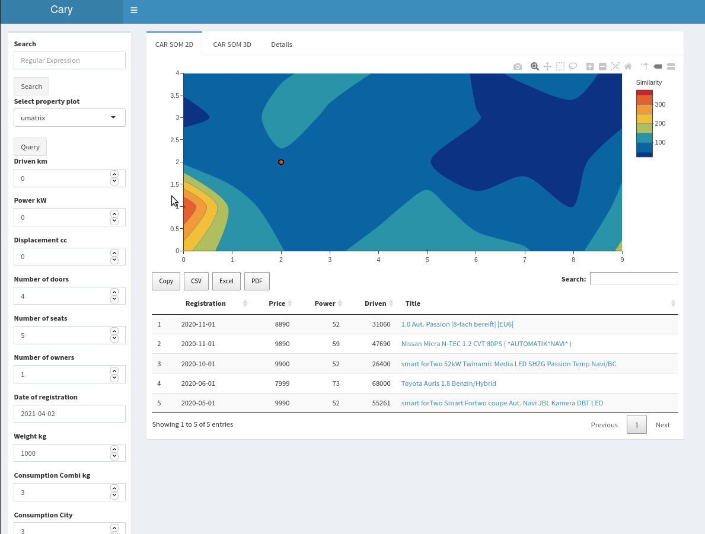

# Cary

A simple car clustering app based on [self-organizing maps](https://en.wikipedia.org/wiki/Self-organizing_map) with the dashboard capability of [shiny](https://shiny.rstudio.com/) and the visualization capabilty of [plotly](https://plotly.com/).

### TODOs
- Enable car query based on user input